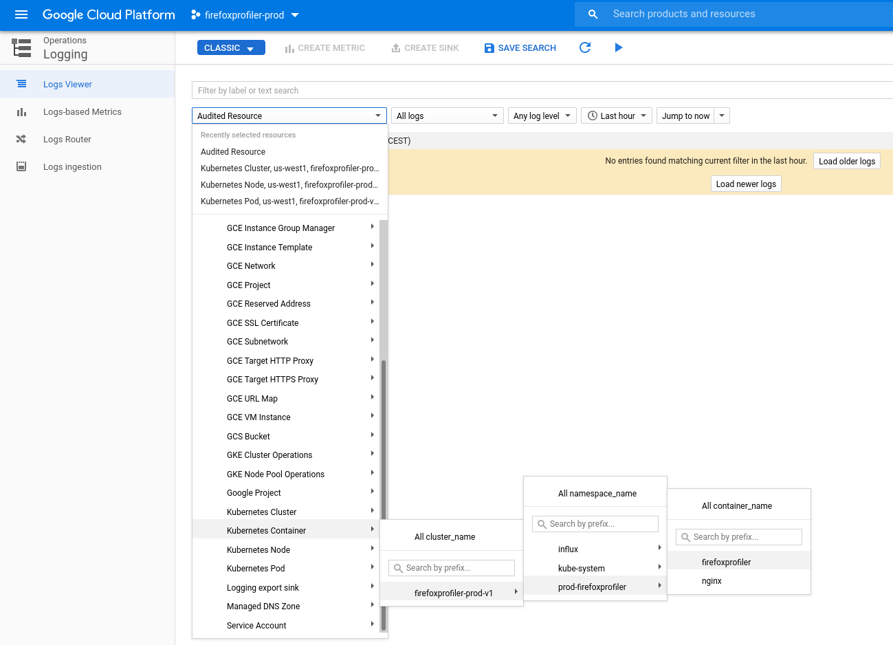

# How deployment works for this server

## Servers

* The `master` branch deploys to https://dev.firefoxprofiler.nonprod.cloudops.mozgcp.net. The storage bucket for this deployment is `moz-fx-dev-firefoxprofiler-bucket`.
* The `production` branch deploys to 2 servers:
  * configured with a sandbox storage: https://stage.firefoxprofiler.nonprod.cloudops.mozgcp.net. The storage bucket for this deployment is `moz-fx-stage-firefoxprofiler-bucket`.
  * configured with the production storage: https://api.profiler.firefox.com.  The storage bucket for this deployment is `profile-store`.

The "stage" server is useful to run load testing runs and compare results with
the current development server. The helper script
[`tools/load-testing-before-deployment.sh`](../tools/load-testing-before-deployment.sh) will do just this.

Note that the two "non production" servers run on the same cluster and are
configured to not auto-scale, so be careful to test them separately. Using the
script, typical results are between 110000 and 130000 successful requests at the
full throughput for these non prod environments.

## Environment

The servers run in Google Cloud Platform.

## Deploying a new version of the server

Every commit to `master` triggers a publishing operation to the staging server.

Similarly every commit to `production` triggers a publishing operation to the
production server.

To deploy a new production server, the easiest is to [create a pull request on
github](https://github.com/firefox-devtools/profiler-server/compare/production...master?expand=1).

It would be nice to write down the main changes in the PR description.

After the PR is created all checks should run. When it's ready the PR can be
merged. Be careful to always use the **create a merge commit** functionality,
not *squash* or *rebase*, to keep a better history.

## Checking the currently deployed version

The server exposes the version information in its `/__version__` endpoint:
* [for staging](https://dev.firefoxprofiler.nonprod.cloudops.mozgcp.net/__version__)
* [for production](https://api.profiler.firefox.com/__version__)

## Access to logs

Only the team members can access to the logs.

Here are the instructions to find them:
1. Connect to [Google Cloud Platform](https://console.cloud.google.com/).
2. Make sure you're using your mozilla account (using the top right button).
3. You need to select a project from the dropdown at the top.
   1. Select from `firefox.gcp.mozilla.com` (dropdown at the top of the modal).
   2. Then pick either `firefoxprofiler-prod` or `firefoxprofiler-nonprod`,
      depending whether you want to look at the data for (respectively) the
      production server or the staging server.
4. Select `Logging` from the general menu, that you open with the top left
   button.
5. From the left dropdown, choose:
   * for prod: Kubernetes Container > firefoxprofiler-prod-v1 > prod-firefoxprofiler > firefoxprofiler or nginx
   * for staging: Kubernetes Container > firefoxprofiler-nonprod-v1 > dev-firefoxprofiler > firefoxprofiler or nginx

We can't provide direct links because they depend on your local context
(especially how many accounts do you have, your current time).

## Some useful links

[Docker Hub](https://hub.docker.com/repository/docker/mozilla/profiler-server/)
contains all pushed docker images. Look especially for the tags `master-latest`
and `production-latest`. Note you need to log in to docker to see this page.

[Google Cloud Platform](https://console.cloud.google.com/) is the environment
our servers run in.

[Our Dockerfile recipe](https://github.com/firefox-devtools/profiler-server/blob/master/Dockerfile).

## Mozilla internal contacts

You can find the Mozilla contacts about our deployment in [this Mozilla-only
document](https://docs.google.com/document/d/16YRafdIbk4aFgu4EZjMEjX4F6jIcUJQsazW9AORNvfY/edit).
